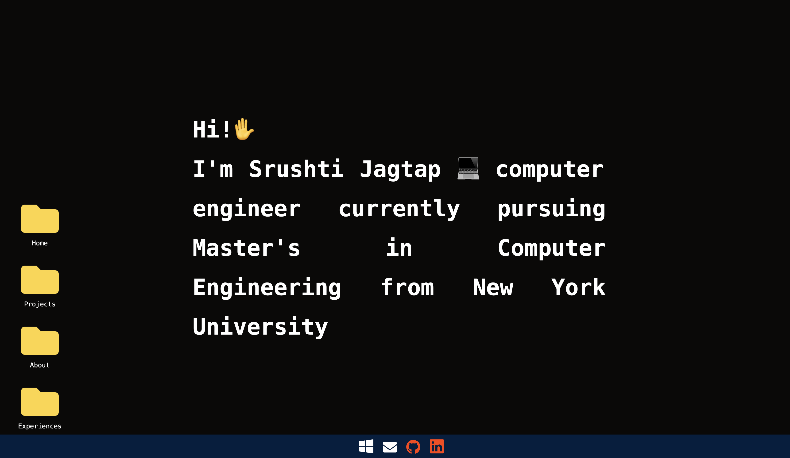

<<<<<<< HEAD
# Portfolio
I have created my portfolio website Using Svelte . This website is not like your ordinary portfolio website but has a User Interface like a Desktop . It makes the users feel as if they are surfing through a desktop and can open folders to read the respective information available .
=======
# ⚡️SvelteKit-Portfolio⚡️

## A personal portfolio website made using `@sveltejs/kit`.
The user can surf through this website as if its a Desktop . There are four folders and a NavBar below. The four folders Home, Projects, About and Experiences and Detailed information about me . The NavBar has icons and hyperlinks to github and linkedin. 
Recommended : refresh at every page to be updated . 

<p align="left">
    
</p>

To view a demo example, **[click here](https://main--tourmaline-souffle-5202b8.netlify.app)**

## Features

- Modern and Minimal UI Design
- Home, Projects, About and blog sections
- Blog made using `DEV.TO` API. (Medium WIP)
- Fully Responsive
- Performances and SEO optimizations
- Looks Like a Desktop 

# Dependencies

- svelte-icons
- @sveltejs/adapter-netlify

# Steps ▶️

```
# Clone this repository
$ git clone https://github.com/Ladvace/SvelteKit-Portfolio
```

```
# Go into the repository
$ cd SvelteKit-Portfolio
```

```
# Install dependencies
$ npm install
```

```
# Start the project in development
$ npm run dev
```

# Deploy on Netlify 🚀

Deploying your website on Netlify it's optional but I reccomand it in order to deploy it faster and easly.

You just need to fork this repo and linking it to your Netlify account.

link to my portfolio : https://main--tourmaline-souffle-5202b8.netlify.app 


To make changes or regarding this project contact : sj4182@nyu.edu
>>>>>>> 78bb544 (First Commit)
